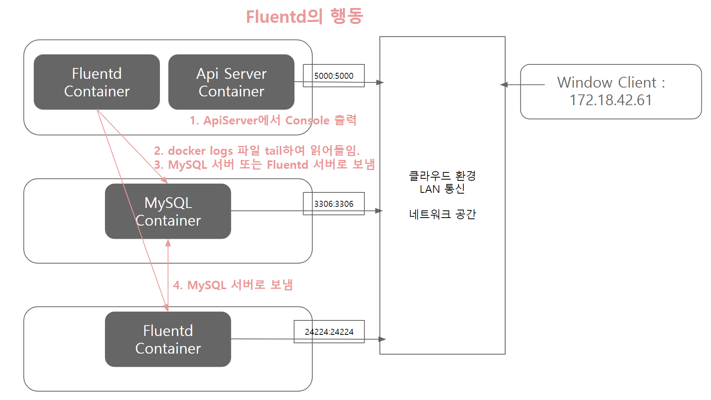
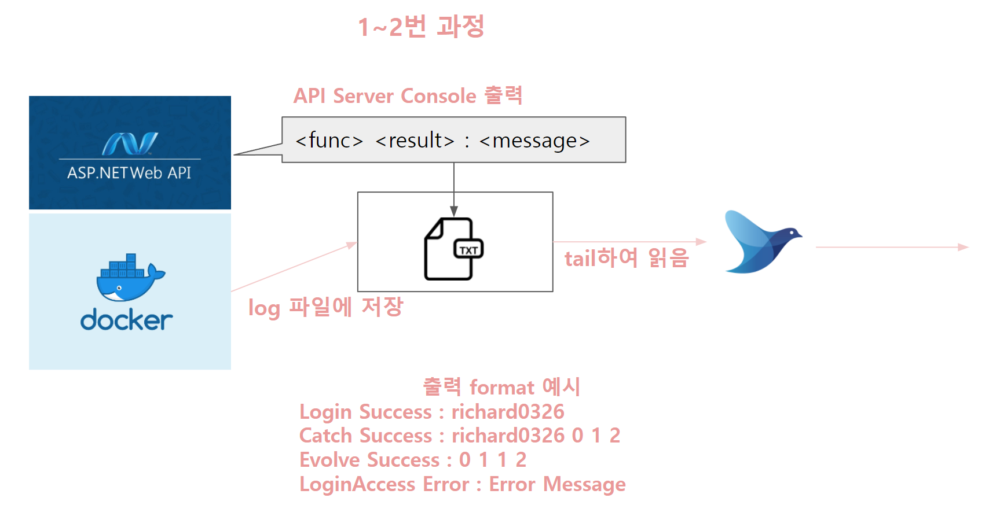
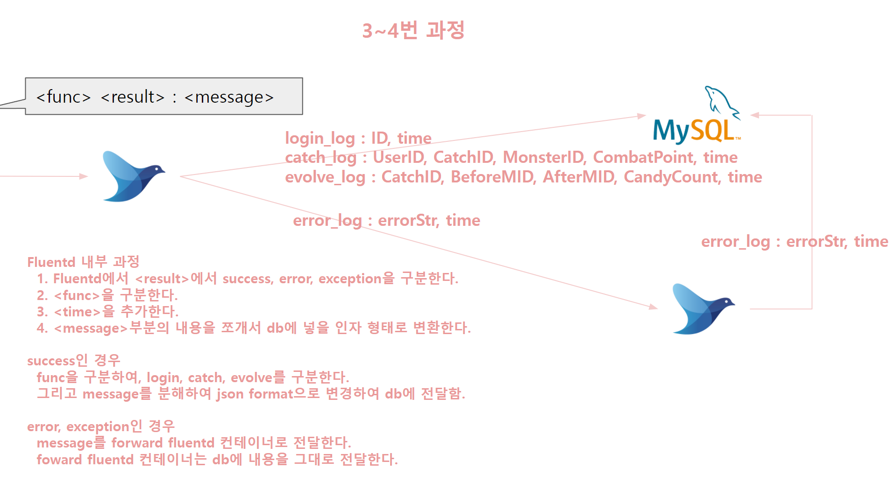

# 테스트 환경 구조 및 흐름
    

  

  

  

# docker 설치, 켜기
sudo wget -qO- http://get.docker.com/ | sh  
sudo systemctl start docker  

# docker build  
richard0326/robotmon-go-apiserver  
ApiServer build할때 사용한 dockerfile  
(https://github.com/richard0326/RobotMon-Go/blob/main/Setting/apiserver/Dockerfile)  

richard0326/fluentd  
Fluentd에 MySQL5.6.36 포함하여 build할때 사용한 dockerfile  
(https://github.com/richard0326/RobotMon-Go/blob/main/Setting/fluentdSettings/Dockerfile)  

# 개발 환경
.NET core SDK 6.0.1  
Docker 20.10.12   

# Docker image version
MySQL 5.6.36  
Redis 6.2.6  
Fluentd 1.14.0  
rockylinux 8.5   

# 클라우드 서버 환경
CentOS 8  

# build된 container 다운 받기
sudo docker pull richard0326/robotmon-go-apiserver  
sudo docker pull richard0326/fluentd  

# 사전 작업
1. OS 사전 작업  
경로에 접근 권한이 있도록 허용해준다.  
sudo chmod -R  00777 "richard0326"  
  
2. mysql 사전 작업  
mysql의 dump 파일을 미리 세팅해둔다.  
인게임 정보에 대한 덤프 파일  
(https://github.com/richard0326/RobotMon-Go/blob/main/Setting/mysql/DumpInGame_my5_6_36.sql)  
로그에 대한 덤프 파일  
(https://github.com/richard0326/RobotMon-Go/blob/main/Setting/mysql/DumpLog_my5_6_36.sql)  
  
3. fluentd 사전 작업  
fluentd conf 파일을 미리 volume될 경로에 세팅해둔다.  
/etc/docker/daemon.json 파일이 없다면 콘솔 출력을 읽을 수 없음.  
(https://github.com/richard0326/RobotMon-Go/tree/main/Setting/fluentdSettings/daemon.json)  
/var/lib/docker/containers/... 안쪽에 콘솔 출력에 대한 로그가 생긴다.  
docker inspect <container>를 통해 LogPath의 경로를 알 수 있다.  
apiserver 컨테이너의 fluentd.conf 파일  
(https://github.com/richard0326/RobotMon-Go/tree/main/Setting/fluentdSettings/fluent.conf)  
forward 기능만 있는 fluentd 컨테이너의 fluentd.conf 파일  
(https://github.com/richard0326/RobotMon-Go/blob/main/Setting/fluentdSettings/fluentForward.conf)  

# mysql 실행하기
1. 컨테이너 실행 명령어  
sudo docker run --name mysql-container -e MYSQL_ROOT_PASSWORD=root1234 -d -p 3306:3306 -v /home/richard0326:/var/lib/mysql mysql:5.6.36    
sudo docker exec -it mysql-container bash   

# redis 실행하기
1. 컨테이너 실행 명령어  
sudo docker run -p 6379:6379 --name myredis -d redis  

# foward fluentd 실행하기  
forward를 진행할 fluentd 서버  
1. 컨테이너 실행 명령어  
sudo docker run -u root -p 24224:24224 -v /home/richard0326/fluentForward.conf:/fluentd/etc/fluent.conf --name fluentd_forward richard0326/fluentd  
  
# apiserver 실행하기
1. fluentd 컨테이너 실행 명령어  
sudo docker run -u root -v /home/richard0326/fluent.conf:/fluentd/etc/fluent.conf -v /home/richard0326:/fluentd/logs/ --name fluentd richard0326/fluentd  
  
2. apiserver 컨테이너 실행 명령어  
sudo docker run -d --privileged -p 5000:5000 -v /home/richard0326:/home/fluentd --name apiserver richard0326/robotmon-go-apiserver /sbin/init  

3. apiserver 컨테이너 접속 명령어  
sudo docker exec -it apiserver /bin/bash   

4. apiserver 서버 실행 시키기  
cd home/net6.0  
vi MyConfig.json    
(https://github.com/richard0326/RobotMon-Go/blob/main/APIServer/MyConfig.json)  
아래와 같이 변경해준다.  
{  
  "Environment": "Production",  
  "urls": "http://*:5000",  
  "logdir": "/home/fluentd/"  
}    
참고로  
"Production"로 설정하면 실행파일에서 appsettings.Production.json을 실행  
"Development"로 설정하면 실행파일에서 appsettings.Development.json을 실행  
appsettings.Production.json 파일은 Redis, DB의 ip, port가 클라우드 환경에 맞게 세팅되어 있음.   
(https://github.com/richard0326/RobotMon-Go/blob/main/APIServer/appsettings.Production.json)  
dotnet ApiServer.dll   

# 테스트  
테스트는 메인 화면의 README.md를 참고하여 진행하면 좋을 것 같습니다.  
(https://github.com/richard0326/RobotMon-Go#readme)  
