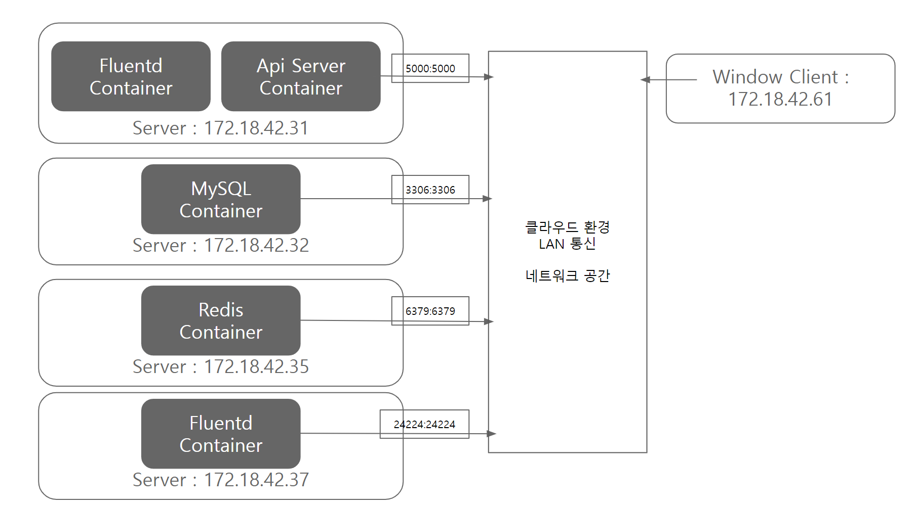

# 테스트 환경 구조
    

# docker 설치, 켜기
sudo wget -qO- http://get.docker.com/ | sh  
sudo systemctl start docker  

# docker build  
richard0326/robotmon-go-apiserver  
ApiServer build할때 사용한 dockerfile (../Setting/apiserver/Dockerfile)  
richard0326/fluentd  
Fluentd에 MySQL5.6.36 포함하여 build할때 사용한 dockerfile (../Setting/fluentdSettings/Dockerfile)  

# version
OS  
Docker  
MySQL 5.6.36  
Redis  
Fluentd  

# build된 container 다운 받기
sudo docker pull richard0326/robotmon-go-apiserver  
sudo docker pull richard0326/fluentd  

# 사전 작업
1. OS 사전 작업  
경로에 접근 권한이 있도록 허용해준다.  
sudo chmod -R  00777 "richard0326"  
  
2. mysql 사전 작업  
mysql의 dump 파일을 미리 세팅해둔다.  
인게임 정보에 대한 덤프 파일 (../Setting/mysql/DumpInGame_my5_6_36.sql)  
로그에 대한 덤프 파일 (../Setting/mysql/DumpLog_my5_6_36.sql)  
  
3. fluentd 사전 작업  
fluentd conf 파일을 미리 volume될 경로에 세팅해둔다.  
나는 /home/richard0326 위치에 넣어두었음.  

# mysql 실행하기
1. 컨테이너 실행 명령어  
sudo docker run --name mysql-container -e MYSQL_ROOT_PASSWORD=root1234 -d -p 3306:3306 -v /home/richard0326:/var/lib/mysql mysql:5.6.36   

2. 컨테이너 접속 명령어  
sudo docker exec -it mysql-container bash   

# redis 실행하기
1. 컨테이너 실행 명령어  
sudo docker run -p 6379:6379 --name myredis -d redis  

# foward fluentd 실행하기  
forward를 진행할 fluentd 서버  
1. 컨테이너 실행 명령어  
sudo docker run -u root -p 24224:24224 -v /home/richard0326/fluentForward.conf:/fluentd/etc/fluent.conf --name fluentd_forward richard0326/fluentd  
  
# apiserver 실행하기
1. fluentd 컨테이너 실행 명령어  
sudo docker run -u root -v /home/richard0326/fluent.conf:/fluentd/etc/fluent.conf -v /home/richard0326/fluentdlog:/fluentd/logs --name fluentd richard0326/fluentd  

2. apiserver 컨테이너 실행 명령어  
sudo docker run -d --log-driver json-file --log-opt max-size=10m --privileged -p 5000:5000 -v /home/richard0326:/home/fluentd --name apiserver richard0326/robotmon-go-apiserver /sbin/init  

3. apiserver 컨테이너 접속 명령어  
sudo docker exec -it apiserver /bin/bash   

4. apiserver 서버 실행 시키기  
cd home/net6.0  
vi MyConfig.json  
"Environment": "Development" -> "Production"  
(../APIServer/appsettings.Production.json) 파일에 Redis, DB ip가 클라우드 환경에 맞게 세팅되어 있음.  
"urls"도 변경 가능하다.  
2가지 명령어로 실행이 가능함.  
1. dotnet APIServer.dll   
2. dotnet APIServer.dll --urls "http://*:5000"  
urls를 인자로 사용하면 기존의 내용이 오버라이드 된다.  
