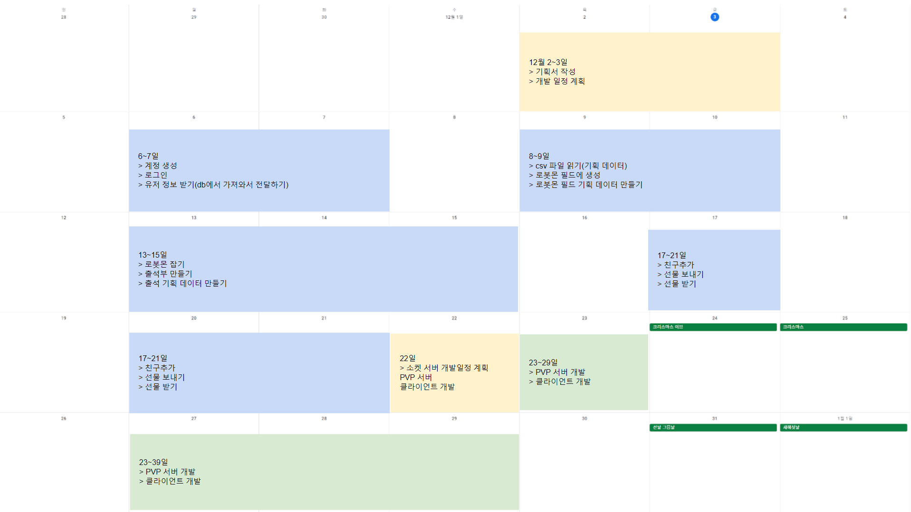
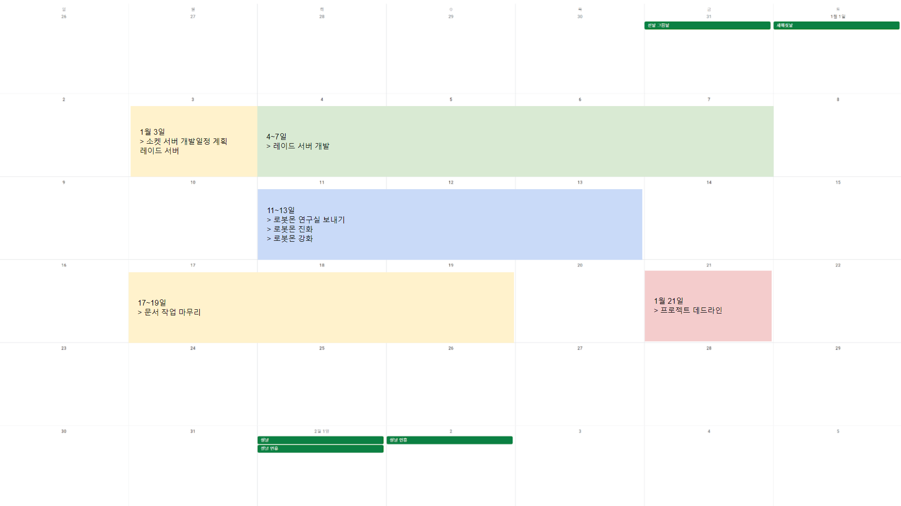

# RobotMon-Go
- 포켓몬고를 모방한 게임 개발
 
## 사용할 기술
- Linux
- MySQL
- Redis  
- C#
- ASP.NET Core WebAPI
- SuperSocketLite
- Git
  
  
  
## 문서
- 서버 구조도
- 패킷(WebAPI에서는 요청과 응답) 시퀸스 다이얼 그램
    - PlantUML로 작성한다
  
## 서버 애플리케이션 실행
- 최종적으로 Rocky Linux에서 실행될 예정이다  
- 개발 머신의 OS가 Windows라면 VirtualBox를 설치한 후 Rocky Linux를 설치한다.
- 최대한 실제와 비슷하게 하기 위해 개발 머신에서 리눅스로 서버 애플리케이션 실행 파일과 리소스 파일을 배포한다.
    - Host OS와 VirtualBox 간의 공유 디렉토리나 클립보드 복사 방식은 사용하지 않는다.
	- SSH, SFTP, Git 등을 사용하여 배포한다.
  
## 개발일정표

