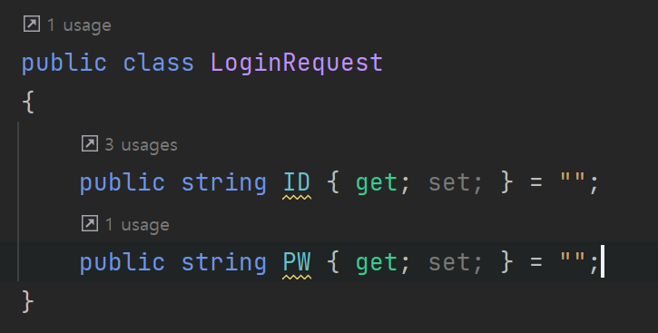
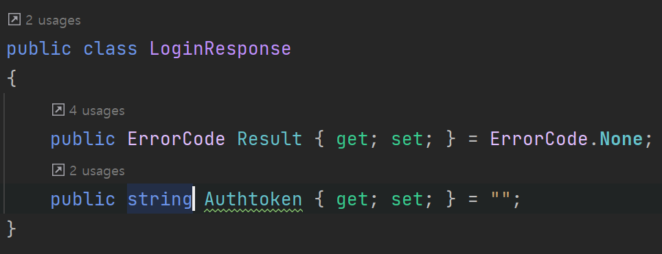
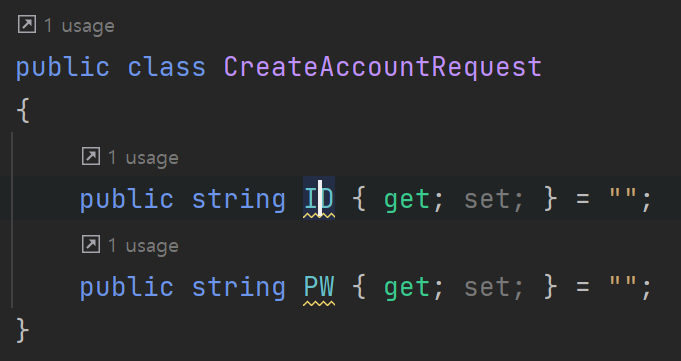
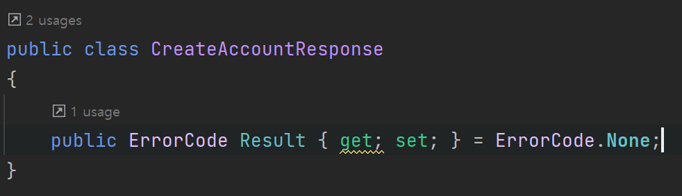

# RobotMon-Go
- 포켓몬고를 모방한 게임 개발
 
## 사용할 기술
- Linux
- MySQL
- Redis  
- C#
- ASP.NET Core WebAPI
- SuperSocketLite
- Git
  
  
  
## 문서
- 서버 구조도
- 패킷(WebAPI에서는 요청과 응답) 시퀸스 다이얼 그램
    - PlantUML로 작성한다
- Database Table

## 서버 애플리케이션 실행
- 최종적으로 Rocky Linux에서 실행될 예정이다  
- 개발 머신의 OS가 Windows라면 VirtualBox를 설치한 후 Rocky Linux를 설치한다.
- 최대한 실제와 비슷하게 하기 위해 개발 머신에서 리눅스로 서버 애플리케이션 실행 파일과 리소스 파일을 배포한다.
    - Host OS와 VirtualBox 간의 공유 디렉토리나 클립보드 복사 방식은 사용하지 않는다.
	- SSH, SFTP, Git 등을 사용하여 배포한다.

## 개발일정
- 개발일정, 기획서 작성 (12/2~3)  
- 로그인 (12/3~8)  
- 계정 생성 (12/4~8)  
- 게임 정보 받기 (12/8~ )  
- csv tool 개발 (12/8~ )  

## 서버 실행 방법
windows 환경  
1번 방식  
- 실행 파일(app.exe, app.dll)이 있는 파일 경로로 이동한다.
- 다음 명령어로 실행 : "dotnet [프로젝트명].dll --urls [IP주소]"

2번 방식  
- cmd 창에서 다음 명령어로 실행 : "dotnet run --project [프로젝트경로] --urls [IP주소]" 

사용 예시
- 명령어1 : dotnet ApiServer.dll --urls "http://localhost:5110"
- 명령어2 : dotnet run --project C:\Users\ ... \RobotMon-Go\ApiServer\ApiServer.csproj --urls "http://*:5110"

## URL 설명
모든 요청은 POST로 진행  
http://[IP]:[port]/Login   
Req  
  
Res  
  
  
http://[IP]:[port]/CreateAccount  
Req    
  
Res  
  
