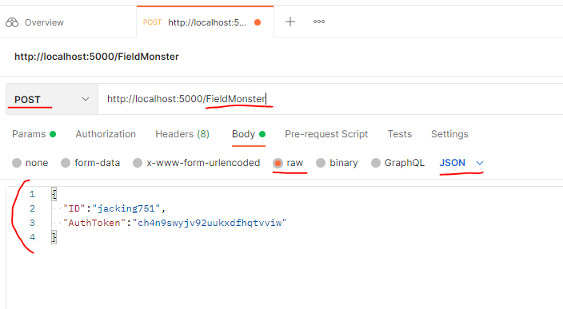

# RobotMon-Go
- 포켓몬고를 모방한 게임 개발
 
## 사용할 기술
- Linux
- MySQL
- Redis  
- C#
- ASP.NET Core WebAPI
- SuperSocketLite
- Git
  
  
  
## 문서
- 서버 구조도
- 패킷(WebAPI에서는 요청과 응답) 시퀸스 다이얼 그램
    - PlantUML로 작성한다
- Database Table

## 서버 애플리케이션 실행
- 최종적으로 Rocky Linux에서 실행될 예정이다  
- 개발 머신의 OS가 Windows라면 VirtualBox를 설치한 후 Rocky Linux를 설치한다.
- 최대한 실제와 비슷하게 하기 위해 개발 머신에서 리눅스로 서버 애플리케이션 실행 파일과 리소스 파일을 배포한다.
    - Host OS와 VirtualBox 간의 공유 디렉토리나 클립보드 복사 방식은 사용하지 않는다.
	- SSH, SFTP, Git 등을 사용하여 배포한다.

## 개발일정
- 웹서버 개발일정, 기획서 작성 (12/2~3)  
- 로그인 (12/3~8)  
- 계정 생성 (12/4~8)  
- 게임 정보 받기 (12/8~9)  
- csv tool 개발 (12/9)
- 필드 정보 받기 (12/9)
- 잡기 기능(12/13)
- 출석 기능(12/14~16)
- 우편함(12/17~20)
    - 우편 리스트 보기. 한번에 10개까지씩 
	- 우편 받기	
- 서버 테스트
    - VirtualBox에 Rocky Linux 설치하기(12/20)
    - Rocky Linux 사용법 숙지하기(?)
    - 2대의 다른 머신에서 테스트(12/20)
- 랭킹(12/23~25)
- 연구실 보내기(12/27)
- 진화(12/27~ )
- 강화(12/27~ )
- 레이드, 클라 소켓서버 개발일정, 기획서 작성(12/23~24)
- 레이드, 클라 구현하기( 세부 개발일정 추가 예정 ) 
- 시간 여유되면 구현할 것
  - 로그(fluentd)
  - 배치Job 프로그램(기간 지난 우편 정리)
  - 교환기능

## 서버 실행 방법
windows 환경  
1번 방식  
- 실행 파일(app.exe, app.dll)이 있는 파일 경로로 이동한다.
- 다음 명령어로 실행 : "dotnet [프로젝트명].dll --urls [IP주소]"

2번 방식  
- cmd 창에서 다음 명령어로 실행 : "dotnet run --project [프로젝트경로] --urls [IP주소]" 

사용 예시
- 명령어1 : dotnet ApiServer.dll --urls "http://localhost:5110"
- 명령어2 : dotnet run --project C:\Users\ ... \RobotMon-Go\ApiServer\ApiServer.csproj --urls "http://*:5110"

## URL 설명
사용 예시  :  
      
모든 요청은 POST로 진행  
body를 객체와 일치하여 Json 포맷으로 보내면 됨.  
이 파일 참고 : https://github.com/richard0326/RobotMon-Go/blob/main/APIServer/httpTest.http

http://[IP]:[port]/Login   
요청 Req : https://github.com/richard0326/RobotMon-Go/blob/main/APIServer/Model/LoginRequest.cs   
응답 Res : https://github.com/richard0326/RobotMon-Go/blob/main/APIServer/Model/LoginResponse.cs   
  
http://[IP]:[port]/CreateAccount  
요청 Req : https://github.com/richard0326/RobotMon-Go/blob/main/APIServer/Model/CreateAccountRequest.cs   
응답 Res : https://github.com/richard0326/RobotMon-Go/blob/main/APIServer/Model/CreateAccountResponse.cs   

http://[IP]:[port]/UserGameInfo  
요청 Req : https://github.com/richard0326/RobotMon-Go/blob/main/APIServer/Model/UserGameInfoRequest.cs   
응답 Res : https://github.com/richard0326/RobotMon-Go/blob/main/APIServer/Model/UserGameInfoResponse.cs   

http://[IP]:[port]/FieldMonster  
요청 Req : https://github.com/richard0326/RobotMon-Go/blob/main/APIServer/Model/FieldMonsterRequest.cs   
응답 Res : https://github.com/richard0326/RobotMon-Go/blob/main/APIServer/Model/FieldMonsterResponse.cs   

http://[IP]:[port]/Catch  
요청 Req : https://github.com/richard0326/RobotMon-Go/blob/main/APIServer/Model/CatchRequest.cs   
응답 Res : https://github.com/richard0326/RobotMon-Go/blob/main/APIServer/Model/CatchResponse.cs   
